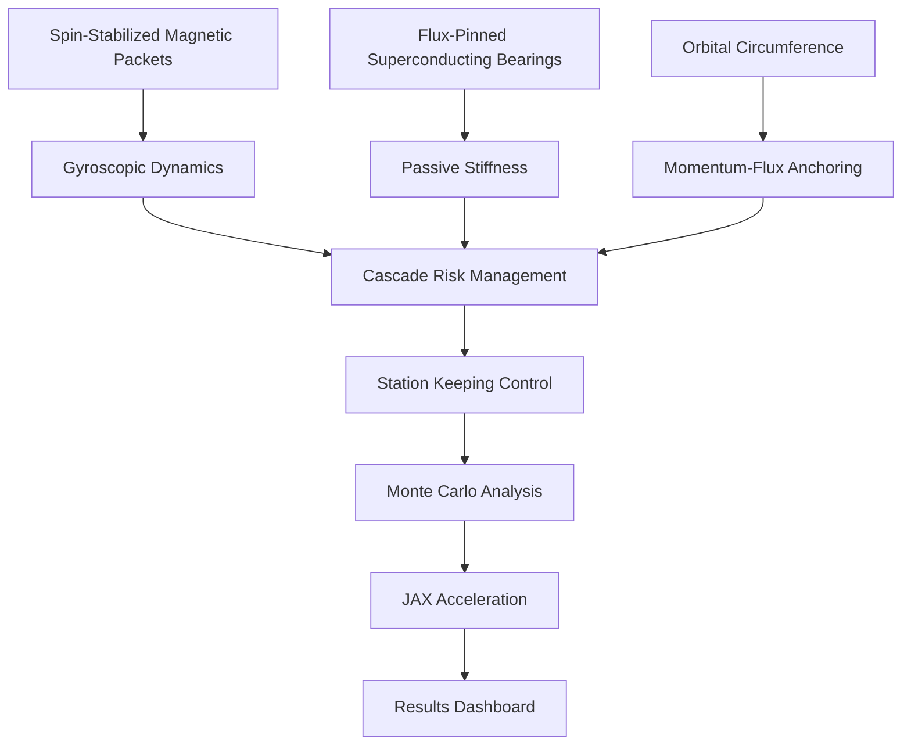

# SpinnyBall

Closed-loop gyroscopic mass-stream anchor for station-keeping in cislunar space.

> [!WARNING]
> ### CRITICAL PHYSICAL FEASIBILITY LIMIT: THE PRECISION THRESHOLD SHOWSTOPPER
> 
> The physical feasibility of the SpinnyBall mass-stream anchor is fundamentally limited by **extreme precision requirements** that present severe engineering showstoppers:
> 
> - **Nanorad Launch Targeting ($<10^{-9}\text{ rad}$):** Launching 35-kg packets at 15 km/s across 380,000 km ballistic corridors requires sub-nanorad angular precision to hit receiving stator apertures. A deviation of just $0.0001^{\circ}$ offsets the packet by over 660 km, creating a stream of destructive hypervelocity space debris.
> - **Sub-Microsecond Control Latency ($\le 5\ \mu\text{s}$):** Compressing packet spacing to equal interaction length ($L_{\text{spacing}} \approx L_{\text{int}} \approx 1.5\text{ m}$) suppresses pulsed mechanical shocks but demands active Model Predictive Control (MPC) operating with a closed-loop delay $\tau_{\text{delay}} \le 5\ \mu\text{s}$ to prevent lateral shepherding collapse. A $1\ \mu\text{s}$ timing delay results in a $1.5\text{ cm}$ spatial lag, causing hypervelocity stator collisions.
> - **Gyroscopic writhing torque cancellation:** Paired CW and CCW streams must perfectly cancel the $1.99\text{ MN}\cdot\text{m}$ of gyroscopic torque with sub-micron spatial and phase synchronization.
> 
> As such, the system remains a highly speculative, uncertainty-bounded theoretical model whose real-world execution requires shepherding and manufacturing precision that exceeds current state-of-the-art capabilities.

## Overview

Spin-stabilized magnetic packets (50k RPM) circulate along an orbital circumference. Momentum-flux anchoring generates restoring force: F = λu²sin(θ). Flux-pinned superconducting bearings provide passive stiffness. Two material options: SmCo (passive, ~379K) or GdBCO (active cryogenic, ~77K).


## Architecture



## Physics

- Gyroscopic dynamics: I·ω̇ + ω×(I×ω) = τ
- Flux-pinning: Jc(B,T) = Jc0·(1-T/Tc)^n·f(B)
- Effective stiffness: k_eff = λu²g_gain + k_fp
- Centrifugal stress: σ = m·ω²r/(4πr) at operational spin rates

## Key Results

### Performance Metrics
- **Cascade boundary**: λ_crit ≈ 15–20/hr (stress test, N=100). System stable at operational rates (<10⁻³/hr) with >99.99% containment.
- **Monte Carlo**: 256k realizations via JAX/XLA in 0.96s. T3 sweep extended to 3600s for rare-event statistics.
- **Sobol (9 params, N=1,024 base → 20,480 evaluations)**: Velocity dominates mass variance (79%) and k_eff variance (81%). SmCo feasibility 0.3%, GdBCO 17.3% with 1-year lifetime constraint enforced.
- **Speedup**: 3,751× faster than legacy CPU implementations with JAX acceleration
- **Infrastructure mass scaling**: High velocities bound the circulating active-stream mass envelope, though total integrated system mass is governed by non-linear control stator and cryogenic scaling.

### Material Comparison (N=20,480 samples each)
| Magnet | Structure | Feasibility | Active-Stream Mass Limit | Power | Notes |
|--------|-----------|------------:|:-------------------------|------:|-------|
| SmCo | BFRP | 0.28% | Bounded by velocity scaling | ~0 W | Passive thermal @ 379K |
| SmCo | CNT_yarn | 1.33% | Bounded by velocity scaling | ~0 W | Best SmCo option |
| GdBCO | BFRP | 17.6% | Bounded by velocity scaling | ~2 MW | High stiffness, cryogenic |
| GdBCO | CNT_yarn | 28.5% | Bounded by velocity scaling | ~2 MW | Best overall feasibility |

**Trade-off**: SmCo enables passive cooling (zero power) but lower feasibility due to thermal constraints. GdBCO provides higher field strength and feasibility but requires MW-scale cryocooling infrastructure.

### Visual Results Summary
📊 **Performance Comparison**              |  📈 **System Stability Analysis**
:---------------------------------------:|:---------------------------------------:
 | 

## Getting Started

### Prerequisites
- Python 3.9+
- Poetry package manager

### Quick Setup

```bash
poetry install
python src/sgms_anchor_v1.py
pytest tests/test_simulation_invariants.py -v
python check_damping.py
```

## Documentation

- **[Architecture Guide](ARCHITECTURE.md)** — v2.0 simulation framework with uncertainty quantification
- [Technical Specification](docs/TECHNICAL_SPEC.md) — full physics derivations
- [Research Dataset](docs/RESEARCH_DATASET.md) — sweep results and data files
- [Benchmarks](BENCHMARKS.md) — performance metrics
- [Mission Analysis](MISSION_LEVEL_ANALYSIS.md) — operational scenarios

## New in v2.0: Simulation Architecture

The v2.0 release introduces a comprehensive physics simulation framework:

### Key Features
- **Uncertainty Quantification**: All physics outputs include error bounds via `UncertainQuantity`
- **Structure-Preserving Integration**: Symplectic integrators (VelocityVerlet, StormerVerlet) for long-term stability
- **Corrected Physics**: Fixed equations for Halbach field, slingshot energy, atmosphere model
- **Multi-Timescale Coupling**: Operator splitting with macro-step scheduling

### Quick Example
```python
from sim.scheduler import MacroScheduler, SchedulerConfig
from sim.domains import MechanicsStreamDomain, OrbitalEnvironmentDomain

# Create multi-physics simulation
scheduler = MacroScheduler(SchedulerConfig(macro_dt=1.0))
scheduler.register_domain("mechanics", MechanicsStreamDomain(n_balls=10))
scheduler.register_domain("orbital", OrbitalEnvironmentDomain())

# Run with uncertainty tracking
scheduler.initialize()
scheduler.run(100.0)
```

See [ARCHITECTURE.md](ARCHITECTURE.md) for detailed documentation.

## Contributing

We welcome contributions! Please read our [Contributing Guidelines](CONTRIBUTING.md) and [Code of Conduct](CODE_OF_CONDUCT.md) before submitting pull requests.

## License

This project is licensed under the terms specified in the LICENSE file - see [LICENSE](LICENSE) for details.

## Contact

Project Link: [https://github.com/msunw/SpinnyBall](https://github.com/msunw/SpinnyBall)