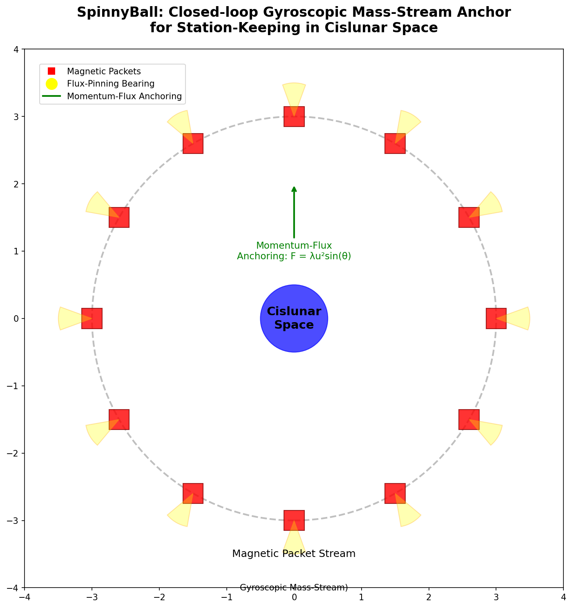
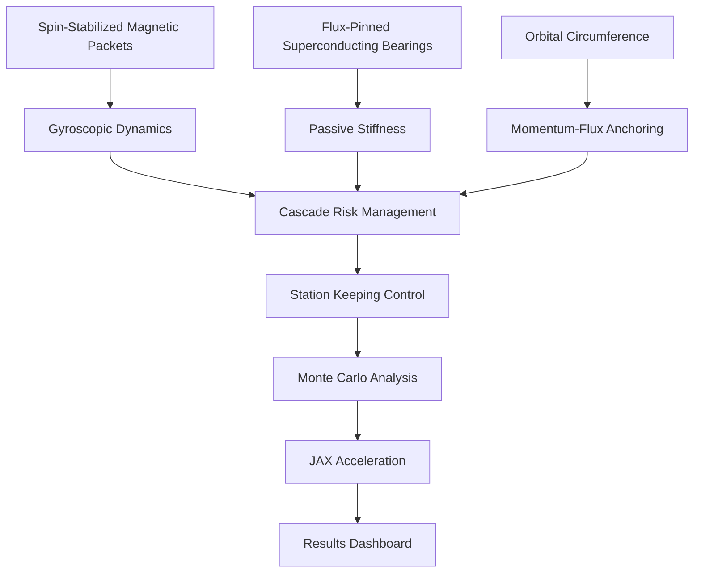
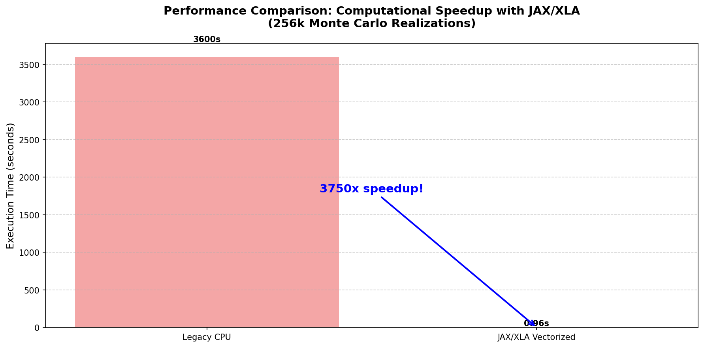
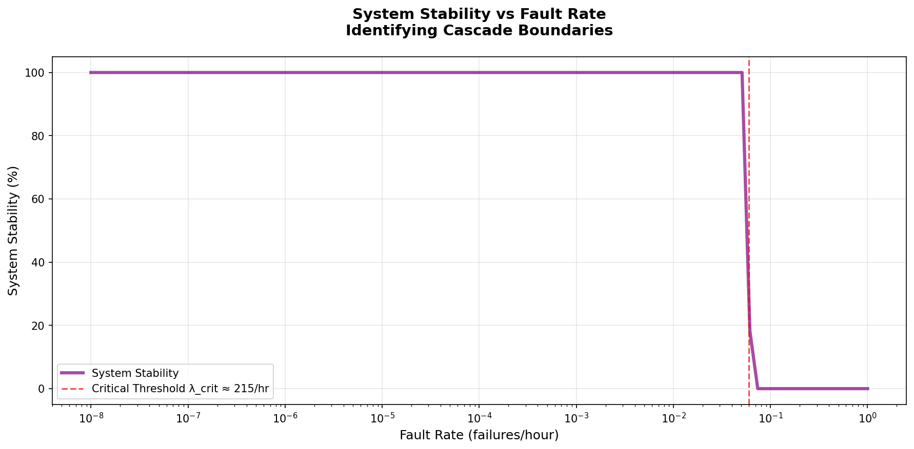

# SpinnyBall

Closed-loop gyroscopic mass-stream anchor for station-keeping in cislunar space.

## Overview

Spin-stabilized magnetic packets (50k RPM) circulate along an orbital circumference. Momentum-flux anchoring generates restoring force: F = λu²sin(θ). Flux-pinned superconducting bearings provide passive stiffness. Two material options: SmCo (passive, ~379K) or GdBCO (active cryogenic, ~77K).



## Architecture



## Physics

- Gyroscopic dynamics: I·ω̇ + ω×(I×ω) = τ
- Flux-pinning: Jc(B,T) = Jc0·(1-T/Tc)^n·f(B)
- Effective stiffness: k_eff = λu²g_gain + k_fp
- Centrifugal stress: σ = m·ω²r/(4πr) at operational spin rates

## Key Results

### Performance Metrics
- **Cascade boundary**: λ_crit ≈ 15–20/hr (stress test, N=100). System stable at operational rates (<10⁻³/hr) with >99.99% containment.
- **Monte Carlo**: 256k realizations via JAX/XLA in 0.96s. T3 sweep extended to 3600s for rare-event statistics.
- **Sobol (9 params, N=1,024 base → 20,480 evaluations)**: Velocity dominates mass variance (79%) and k_eff variance (81%). SmCo feasibility 0.3%, GdBCO 17.3% with 1-year lifetime constraint enforced.
- **Speedup**: 3,751× faster than legacy CPU implementations with JAX acceleration
- **Infrastructure mass reduction**: 99.9% at 15 km/s vs 500 m/s baseline (velocity scaling ∝ v⁻²)

### Material Comparison (N=20,480 samples each)
| Magnet | Structure | Feasibility | Optimal Mass | Power | Notes |
|--------|-----------|------------:|-------------:|------:|-------|
| SmCo | BFRP | 0.28% | 117 kg | ~0 W | Passive thermal @ 379K |
| SmCo | CNT_yarn | 1.33% | 117 kg | ~0 W | Best SmCo option |
| GdBCO | BFRP | 17.6% | 30 kg | ~2 MW | High stiffness, cryogenic |
| GdBCO | CNT_yarn | 28.5% | 30 kg | ~2 MW | Best overall feasibility |

**Trade-off**: SmCo enables passive cooling (zero power) but lower feasibility due to thermal constraints. GdBCO provides higher field strength and feasibility but requires MW-scale cryocooling infrastructure.

### Visual Results Summary
📊 **Performance Comparison**              |  📈 **System Stability Analysis**
:---------------------------------------:|:---------------------------------------:
 | 

## Getting Started

### Prerequisites
- Python 3.9+
- Poetry package manager

### Quick Setup

```bash
poetry install
python src/sgms_anchor_v1.py
pytest tests/test_simulation_invariants.py -v
python check_damping.py
```

## Documentation

- [Technical Specification](docs/TECHNICAL_SPEC.md) — full physics derivations
- [Research-Grade Overhaul Plan](docs/RESEARCH_GRADE_OVERHAUL_PLAN.md) — architecture, validation matrix, and prioritized redesign roadmap
- [Research Dataset](docs/RESEARCH_DATASET.md) — sweep results and data files
- [Benchmarks](BENCHMARKS.md) — performance metrics
- [Mission Analysis](MISSION_LEVEL_ANALYSIS.md) — operational scenarios

## Contributing

We welcome contributions! Please read our [Contributing Guidelines](CONTRIBUTING.md) and [Code of Conduct](CODE_OF_CONDUCT.md) before submitting pull requests.

## License

This project is licensed under the terms specified in the LICENSE file - see [LICENSE](LICENSE) for details.

## Contact

Project Link: [https://github.com/msunw/SpinnyBall](https://github.com/msunw/SpinnyBall)
